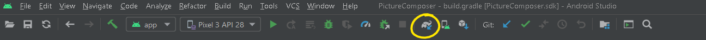
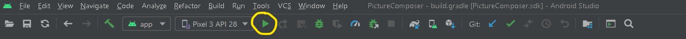
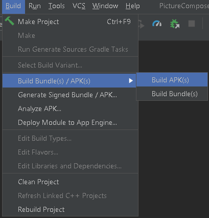
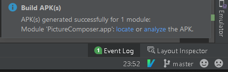

# GW CS Senior Design Project by Brooke Claroni, Giana Fiore & Jekko Syquia

# PhotoComposer
## About
<b>PhotoComposer</b> is an Android smart-camera app that teaches users how to take
better photos. 

To learn more go to the website below:
[PhotoComposer](https://gw-cs-sd.github.io/senior-design-template-f20-s21-sd-f20s21-claroni-fiore-syquia/)

## Important Notes
Before beginning make sure the following requirements are met to build and run
the application.

- Make sure to register and acquire your Pixabay Api Key [here](https://pixabay.com/api/docs/). This is required to build the source code.

  - Copy the API key create a new file called `keys.xml` under <b>PictureComposer > app > src > main > res > values </b>
```XMl
<?xml version="1.0" encoding="utf-8"?>
<resources>
    <string name="pixabay_api_key">PASTE PIXABAY API KEY HERE</string>
</resources>
```
- Please use on a Pixel 3 device running API 28 + or emulate Pixel 3 API 28 through [Android Studio's AVD Manager](https://developer.android.com/studio/run/managing-avds#createavd) 
- If running on a physical device make sure to enable [Developer options](https://developer.android.com/studio/debug/dev-options#enable).

- [Android Studio 4.13](https://developer.android.com/studio/install) or newer to build the source codes

### Installation issues?
- Run gradle sync before building this ensures that libraries are
  downloaded before building.
- Make sure the correct emulator device requirement is met. 

---
## Building and running on Emulator

Make sure the requirements are met in the important notes above before proceeding.
Download our zip folder of code and unzip. Open an existing project in Android Studio and select PictureComposer from your documents. 

*Pixel 3 API 28* should be selected beside the `app` configuration toolbar, if not please select *Pixel 3 API 28* as seen on the screenshot below.

Run `Gradle Sync` by clicking the small elephant icon in the top right corner of Android Studio. 
 

To `Run` the application press the green play button next to the emulator name (Pixel 3  API 28 in this
example)  
 

This will perform a Gradle Build and if it is successful a pop up will display
saying “Success. Operation Succeeded” and the app will install and launch
on your emulator on a separate emulator window.

## Running release apk on a physical Android device
Make sure [developer options](https://developer.android.com/studio/debug/dev-options#enable) is enabled. 

Open the command prompt/terminal in this directory.
cd to the `apk-build` directory. 

```bash
cd apk-build/
```
Run the following to make sure your device is detected.
```bash
adb devices -l
```
A list of devices will be shown and you should see your device connected. 

Now to install the application run the following script
```bash
adb install ./PhotoComposer.apk
```
On success you should get the following:
```
Performing Streamed Install
Success
```

## Running release apk on an emulator
With the Pixel 3 API 28 emulator running in Android Studio. 
Locate the android-build directory and drag the `PhotoComposer.apk` file into the emulator screen and the installation will proceed.

## Building release apk to run on Android devices
To build your own release apk, in Android Studio navigate to the menu bar and select <b>Build > Build Bundle(s) / APK(s) > Build APK(s)</b>.

 

The release apk will start building, this may take a while. 
When the application finish installing an indicator on the lower right *Event Log* will appear
indicating that the APK(s) generated succesfully for 1 module. 

 

Click on *locate* and it will direct you to the .apk file. 
To install proceed with the same instructions above.

## Before continuing development on this project
To continue with development on our project, you may want to gain access to this
project’s Firebase console. This can be accomplished by emailing a current admin
and requesting for permission to join the project as a Firebase admin. Using a
personal email for this is recommended since Firebase treats student accounts
differently.